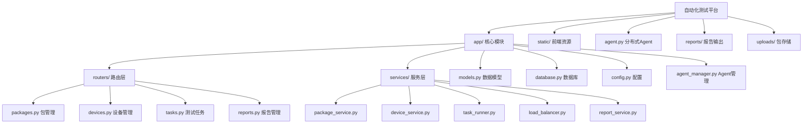

# AI 上下文文档 - 自动化测试平台

> 项目路径: `C:/Users/53217/PycharmProjects/test-platform`
> 技术栈: Python + FastAPI + SQLAlchemy + SQLite
> 更新时间: 2026-03-25

---

## 项目概述

**自动化测试平台**是一个支持分布式设备管理的移动端应用测试系统，主要用于快应用(RPK)和安卓应用(APK)的自动化测试。

**核心功能**:
- 包管理: 支持 APK/RPK 文件上传、解析包名、自动推送到设备
- 设备管理: ADB 设备检测、WiFi ADB 连接、分布式 Agent 管理
- 测试任务: 单任务/批量任务创建、负载均衡分配、实时日志流
- 测试报告: 单任务报告、批量汇总报告、HTML 可视化
- 负载均衡: 最少任务优先/轮询/加权三种策略

---

## 架构总览

```
┌─────────────────────────────────────────────────────────────────┐
│                        自动化测试平台                            │
├─────────────────────────────────────────────────────────────────┤
│  前端 (Alpine.js + Tailwind)                                    │
│  └── static/index.html - 单页应用，包含仪表盘/包管理/任务/报告/设备 │
├─────────────────────────────────────────────────────────────────┤
│  API 层 (FastAPI)                                               │
│  ├── /api/packages   - 包上传、列表、删除                        │
│  ├── /api/devices    - 设备列表、WiFi连接、Agent管理             │
│  ├── /api/tasks      - 任务创建、日志流、批量任务                │
│  └── /api/reports    - 报告列表、查看、删除                      │
├─────────────────────────────────────────────────────────────────┤
│  服务层                                                         │
│  ├── package_service  - 包名解析 (APK/RPK)                       │
│  ├── device_service   - ADB 设备管理                            │
│  ├── task_runner      - 测试执行引擎 (设备级并行)                 │
│  ├── load_balancer    - 设备负载均衡器                          │
│  └── report_service   - HTML 报告生成                           │
├─────────────────────────────────────────────────────────────────┤
│  数据层 (SQLAlchemy + SQLite)                                   │
│  ├── Package - 包信息表                                          │
│  ├── Task    - 测试任务表                                        │
│  └── Report  - 测试报告表                                        │
├─────────────────────────────────────────────────────────────────┤
│  分布式 Agent (WebSocket)                                       │
│  └── agent.py - 运行在用户机器上，上报本地 ADB 设备               │
└─────────────────────────────────────────────────────────────────┘
```

---

## 模块结构图 (Mermaid)



---

## 模块索引

| 模块路径 | 类型 | 职责描述 | 关键文件 |
|---------|------|---------|---------|
| `app/` | Python包 | 核心应用模块 | main.py, models.py, database.py |
| `app/routers/` | 路由层 | API 端点定义 | packages.py, devices.py, tasks.py, reports.py |
| `app/services/` | 服务层 | 业务逻辑实现 | task_runner.py, load_balancer.py, report_service.py |
| `app/static/` | 前端 | 静态资源 | index.html, tailwind.js, alpine.js |
| `reports/` | 输出 | HTML 测试报告 | 自动生成 |
| `uploads/` | 存储 | 上传的包文件 | APK/RPK 存储 |

---

## 运行与开发

**启动命令**:
```bash
# 开发模式 (热重载)
python -m uvicorn app.main:app --host 0.0.0.0 --port 8000 --reload

# 或使用批处理
run.bat
```

**依赖安装**:
```bash
pip install -r requirements.txt
```

**外部依赖**:
- ADB (Android Debug Bridge) - 必须安装并添加到 PATH
- aapt (Android Asset Packaging Tool) - 用于解析 APK 包名

---

## 测试策略

- **单元测试**: 暂无 (建议补充)
- **集成测试**: 通过实际 ADB 设备运行测试
- **手动测试**: 通过 Web UI 上传包、创建设备、执行任务

---

## 编码规范

- Python 代码遵循 PEP 8
- 使用类型注解 (typing)
- 异步函数使用 async/await
- 数据库操作使用 SQLAlchemy ORM

---

## AI 使用指引

**修改建议**:
1. 路由层修改: 编辑 `app/routers/*.py`，遵循 FastAPI 模式
2. 服务层修改: 编辑 `app/services/*.py`，保持单职责原则
3. 模型修改: 编辑 `app/models.py`，修改后需删除数据库文件重新生成
4. 前端修改: 编辑 `app/static/index.html`，使用 Alpine.js 响应式语法

**常见问题**:
- 数据库表结构变更: 删除 `test_platform.db` 后重启服务
- ADB 设备不识别: 检查设备驱动和 USB 调试权限
- 任务卡住: 检查设备连接状态，可取消任务后重试

---

## 变更记录 (Changelog)

| 时间 | 变更内容 |
|------|---------|
| 2026-03-25 | 初始化 AI 上下文文档，完成全仓扫描 |
